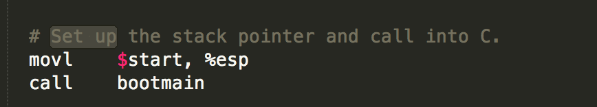
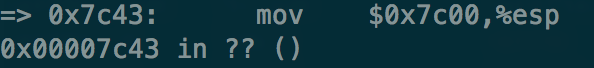
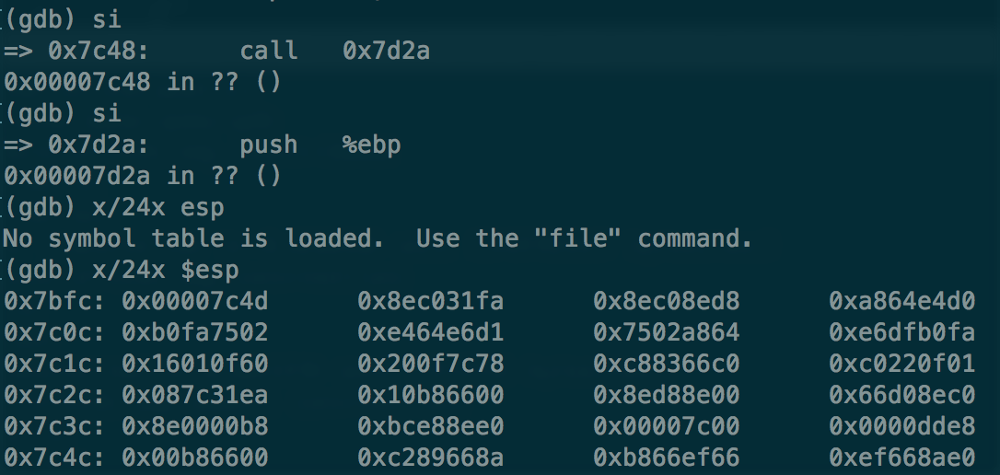

# Homework:boot xv6

主要是熟悉xv6的编译环境，并能运行qemu模拟器和gdb进行调试。

需要注意的是，在macOS环境下（本机为10.12 macOS Sierra）对Makefile文件进行修改，令：

          # TOOLPREFIX = i386-jos-elf
          TOOLPREFIX = i386-elf-

同样，若需要在macOS下编译jos（lab部分），需要在conf/env.mk,如下:

          GCCPREFIX=‘i386-elf-’

1. 在0x7c00设置断点，单步调试，查看$esp寄存器在哪里初始化？

    在PC启动时，BIOS会将硬盘中的第一个扇区读入到内存的0x7c00，该部分为OS的bootstrap区，负责引导并装载操作系统。
    
    首先分析bootasm.S中的源码部分
  
    
    
    gdb调试单步调试到上述指令：

    

    可以看到，$esp初始化为0x7c00。

2. Single step through the call to bootmain; what is on the stack now?

    

3. What do the first assembly instructions of bootmain do to the stack? Look for bootmain in bootblock.asm.

    如上图所示，第一条指令为：push %ebp

4. 

