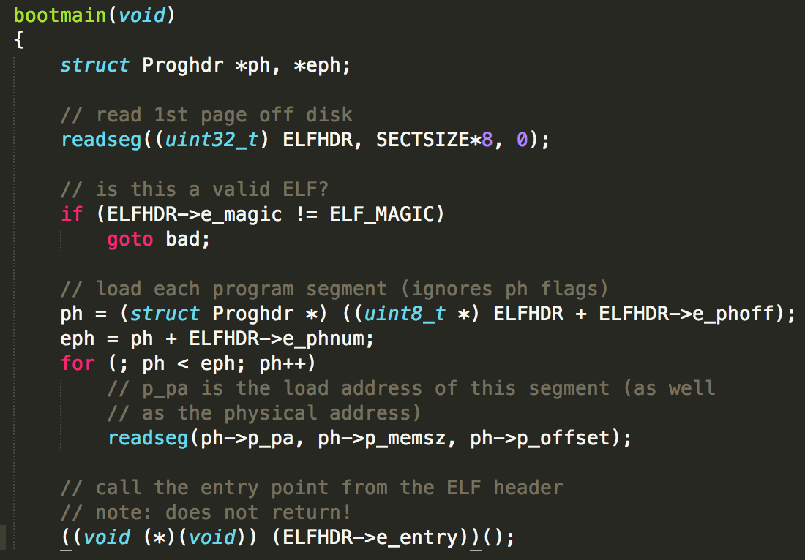

# Question of Lab1 #

## Part 2: The Boot Loader ##

1. At what point does the processor start executing 32-bit code? What exactly causes the switch from 16- to 32-bit mode?

    

    可以看到，转换成保护模式是通过将cr0控制寄存器的低位置1，cr0寄存器用于系统初始化时进行相关配置。

    

2. What is the last instruction of the boot loader executed, and what is the first instruction of the kernel it just loaded?

    

    在boot.S中会进行一些初始化工作，转换成保护模式，然后转入main.c,导入kern。
    unix中内存中文件为[elf格式](http://zke1ev3n.me/2015/12/15/ELF%E6%96%87%E4%BB%B6%E6%A0%BC%E5%BC%8F%E8%A7%A3%E6%9E%90/),main.c中首先建立一个elf文件头，相当于elf文件索引，位于内存0x00010000处，即在low memory区域，然后将kern的第一个扇区读入内存0x00100000处。

    >       +--------------------+
    >       |       32-bit       |
    >       |   Memory Mapped    |
    >       |      devices       |
    >       \/\/\/\/\/\/\/\/\/\/\/
    >
    >       /\/\/\/\/\/\/\/\/\/\/\
    >       |       Unused       |
    >       +--------------------+  <- depends on amount of RAM
    >       |                    |
    >       |   Extended Memory  |
    >       |                    |
    >       +--------------------+  <- 0x00100000 (1MB)
    >       |     BIOS ROM       |
    >       +--------------------+  <- 0x000F0000 (960KB)
    >       |  16-bit divices,   |
    >       |  expansion ROMs    |
    >       +--------------------+  <- 0x000C0000 (768KB)
    >       |     VGA Display    |
    >       +--------------------+  <- 0x000A0000 (640KB)
    >       |                    |
    >       |     low memory     |
    >       |--------------------|  <- 0x00010000 (elf header here)
    >       |--------------------|  <- 0x00007c00 (boot loader here!)
    >       |   bootmain stack   |       
    >       +--------------------+  <- 0x00000000

    至于为什么kernel第一个扇区导入到内存0x00100000位置，这是由编译时决定的，可以看一下编译时的链接程序kernel.ld.

    ```
    /* Link the kernel at this address: "." means the current address */
	. = 0xF0100000;

	/* AT(...) gives the load address of this section, which tells
	   the boot loader where to load the kernel in physical memory */
	.text : AT(0x100000) {
		*(.text .stub .text.* .gnu.linkonce.t.*)
	}
    ```

    即编译时kernel入口虚拟地址定位0xF0100000,但是在entry.S中对虚拟地址进行向下映射到0x100000。

    ```
    # '_start' specifies the ELF entry point.  Since we haven't set up
    # virtual memory when the bootloader enters this code, we need the
    # bootloader to jump to the *physical* address of the entry point.
    .globl		_start
    _start = RELOC(entry)

    .globl entry
    entry:
    ```
    RELOC(entry)的作用是虚拟地址重定位，减去一个KERNBASEK(0xF0000000)。

    kernel运行的第一条指令在entry.S中：
    
    ```
    .globl entry
    entry:
    	movw	$0x1234,0x472			# warm boot
    ```

3. Where is the first instruction of the kernel?

    从2中可知，第一条指令在entry.S中,通过反编译，在obj/kern/kernel.asm可以发现，第一条指令执行地址在0x0010000c。

    ```
    f010000c <entry>:
    f010000c:	66 c7 05 72 04 00 00 	movw   $0x1234,0x472
    ```

4. How does the boot loader decide how many sectors it must read in order to fetch the entire kernel from disk? Where does it find this information?

    首先关于操作系统一共有多少个段，每个段又有多少个扇区的信息位于操作系统文件中的Program Header Table中。这个表中的每个表项分别对应操作系统的一个段。并且每个表项的内容包括这个段的大小，段起始地址偏移等等信息。所以如果我们能够找到这个表，那么就能够通过表项所提供的信息来确定内核占用多少个扇区。那么关于这个表存放在哪里的信息，则是存放在操作系统内核映像文件的ELF头部信息中。